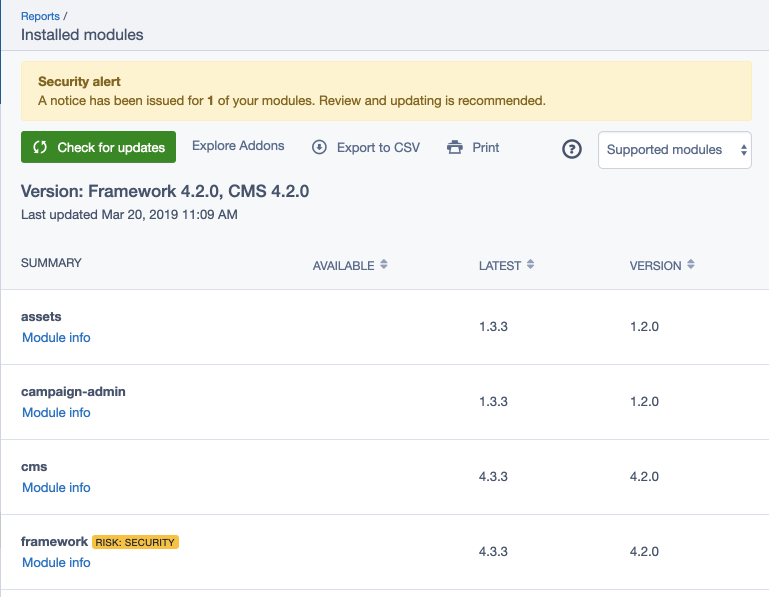

# Installed Modules Report

This user guide provides information on the
[SilverStripe Maintenance module](https://github.com/bringyourownideas/silverstripe-maintenance). It also covers the two
optional modules [Silverstripe Security Checker](https://github.com/bringyourownideas/silverstripe-composer-security-checker)
and [SilverStripe Composer Update Checker](https://github.com/bringyourownideas/silverstripe-composer-update-checker),
which provide the main functionality for the _Installed Modules_ report.

## Usage

SilverStripe websites and the CMS can be highly customised using SilverStripe modules. The 'Installed modules' report
provides an overview of the modules installed for your SilverStripe website.

In the admin section of your SilverStripe website navigate to the Reports section. Open up the 'Installed modules'
report to view the available information.

Please note that you are required to have admin access to view this information.

## Check for updates

Click on the 'Check for Updates' button to refresh the list with the latest available information. Updating this list
may take some time, since it's waiting for the system to run a scheduled job in the background. You can continue to use
the CMS while the update is run.

## Check for additional modules

Click on the 'Browse Modules' button to browse [Silverstripe CMS modules on packagist](https://packagist.org/search/?type=silverstripe-vendormodule).

## What do "Version, Available, Latest" mean?

The [SilverStripe Composer Update Checker module](https://github.com/bringyourownideas/silverstripe-composer-update-checker)
checks if any of your Composer dependencies needs to be updated, and tracks the available and latest versions that can
be updated to.

SilverStripe follows Semantic Versioning. If you would like to learn more see [https://semver.org/](https://semver.org/).

### Version

The information in this column shows the current version of each of the modules you've got installed.

### Available

The information in this column shows the latest installable version of the modules within the version constraints of your
installation. If no version is displayed, you are either already on the latest version available for your constraint,
or your constraint might be very restrictive.

### Latest

The information in this column shows the latest version of the module available. If this varies from the available
version, it means that this latest version is outside of your version constraint of your installation.

## What do the security alerts mean?

The [SilverStripe Composer Security Checker module](https://packagist.org/packages/bringyourownideas/silverstripe-composer-security-checker)
adds a task which runs a check if any of the dependencies has known security vulnerabilities.

Provided this optional module is installed, you may see security alerts, if security updates are present for installed
modules. In that case, clicking on the security badge next to the module name will reveal additional information.

The [SensioLabs Security Check Web service](http://security.sensiolabs.org/) and the
[Security Advisories Database](https://github.com/FriendsOfPHP/security-advisories) are used to generate this information.

Learn more about SilverStripe's [security releases](https://www.silverstripe.org/download/security-releases/) and our
[security release process](https://docs.silverstripe.org/en/4/contributing/release_process/#security-releases).

## Why do I see "dev" versions?

Versions with a `dev` at the start or the end of the version can mean two things:

- Pre-release version: A version that's newer than what's currently stable.
  This is often used by developers to pull in important bugfixes before they
  are released. Choosing when this is appropriate requires
  caution and testing from developers. Example: `4.x-dev`, `dev-master`.
- Fork: A custom version that's different from the module's release lines,
  often created by your developers as a temporary workaround.
  We usually can't tell which version of the module this fork is based on.
  Forks should be short-lived. We recommend you talk to your developers
  about plans to remove it. Example: `dev-pulls/fix-my-bug`
